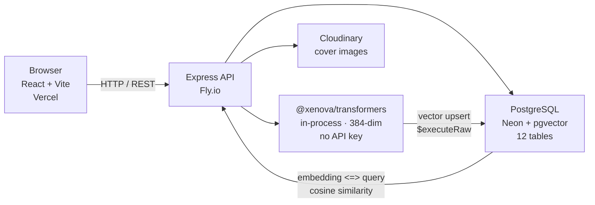

# DevBlog

Full-stack technical blog with semantic search and content-based post recommendations — built on pgvector and in-process sentence-transformer embeddings.

<!-- Replace with your demo GIF: record register → write post → search semantically → see related posts (30s, Kap or ScreenToGif) -->


---

## Live Demo

**[https://devblog.vercel.app](https://devblog.vercel.app)** ← replace with deployed URL

```
email:    demo@devblog.dev
password: devblog2024
```

---

## Semantic Search & Related Posts

Naive `ILIKE` search fails the moment a user's words don't match the author's words. Searching "frontend performance" against posts titled "React render optimization" returns nothing — even though the intent is identical. This project replaces keyword lookup with vector similarity: every published post is embedded into a 384-dimensional float vector using `all-MiniLM-L6-v2` (runs in Node, no API key, ~23 MB model). That vector is stored in PostgreSQL via the `pgvector` extension and queried at search time using cosine distance.

**Pipeline:** post published → `title + excerpt` text → `@xenova/transformers` feature-extraction → 384-dim Float32Array → stored with `prisma.$executeRaw` as `embedding::vector` → at query time, the search string follows the same embed path → ranked by `<=>` cosine distance.

**Concrete example:** querying `"react performance"` returns posts about `"frontend optimization"`, `"render bottlenecks"`, and `"memoization patterns"` even when none of those titles contain the words "react" or "performance."

**Semantic search query:**

```sql
SELECT id, slug, title, excerpt
FROM posts
WHERE status = 'published'
  AND embedding IS NOT NULL
ORDER BY embedding <=> $1::vector
LIMIT 20;
```

**Related posts query** (cosine neighbors of the current post, used in the sidebar widget):

```sql
SELECT id, slug, title, excerpt
FROM posts
WHERE status = 'published'
  AND id != $1
  AND embedding IS NOT NULL
ORDER BY embedding <=> (SELECT embedding FROM posts WHERE id = $1)
LIMIT 5;
```

The `<=>` operator is cosine distance (0 = identical, 2 = opposite). A result under 0.3 is semantically close enough to surface.

> _Built semantic search and content-based "related posts" using sentence-transformer embeddings (`all-MiniLM-L6-v2`) stored in PostgreSQL via the pgvector extension. Replaced naive `LIKE` queries with cosine similarity over a 384-dim vector space; queries return semantically related content even without keyword overlap._

---

## Tech Stack

| Layer                      | Technology                                                                   |
| -------------------------- | ---------------------------------------------------------------------------- |
| **Frontend**               | React 18, Vite, React Router v6, Tailwind CSS, Material Symbols              |
| **Backend**                | Node.js, Express, Prisma ORM, Zod (request validation)                       |
| **Database**               | PostgreSQL (Neon free tier) + `pgvector` extension                           |
| **Embeddings**             | `@xenova/transformers` — `Xenova/all-MiniLM-L6-v2`, 384-dim, runs in-process |
| **Auth**                   | JWT (24 h expiry) + bcrypt                                                   |
| **Image storage**          | Cloudinary (signed uploads)                                                  |
| **Hosting**                | Vercel (frontend) + Fly.io (backend)                                         |
| **Estimated monthly cost** | $0                                                                           |

---

## Architecture



Request flow for a semantic search:

1. `GET /api/search?q=react+performance&mode=semantic`
2. Express embeds the query string (cached pipeline, ~50 ms after warm-up)
3. pgvector ranks all published posts by cosine distance
4. Top 20 results returned with titles, excerpts, and tags

---

## Features

- **Auth** — register (auto-name from email), login, JWT-guarded routes
- **Posts** — CRUD with `draft` / `published` / `archived` states; slug auto-generated; reading time auto-calculated
- **Tags** — 10 system tags (DSA, Web, Cloud, OS, Database, AI, Backend, Frontend, DevOps, Architecture); filterable on feeds
- **Semantic search** — embed query → cosine distance via pgvector; togglable keyword / semantic mode on `/search`
- **Related posts** — 5 vector-nearest neighbors displayed on every post detail page
- **Feeds** — Home (latest published), Following (authors you follow), Bookmarks
- **Reactions** — like toggle per user per post (schema supports 4 types; MVP exposes like)
- **Bookmarks** — toggle save/unsave; dedicated bookmarks feed
- **Comments** — flat thread; soft-delete preserves notification references
- **Follow** — user-to-user follow graph; powers the Following feed
- **Cover images** — Cloudinary signed upload from the editor
- **Author dashboard** — `/my-posts` with status filter (drafts, published, archived)

---

## Local Development

Copy the env template and fill in your credentials (Neon DB URL, JWT secret, Cloudinary keys):

```bash
cp backend/.env.example backend/.env
```

Start the backend (port 5001):

```bash
cd backend && npm install && npm run dev
```

Start the frontend (port 5173) in a second terminal:

```bash
cd frontend && npm install && npm run dev
```

Open `http://localhost:5173`. Seed the database and run the embedding backfill once:

```bash
cd backend && node prisma/seed.js && node scripts/backfill-embeddings.js
```

The backfill script embeds all published seed posts so semantic search has a corpus to rank. Without it, the search page returns nothing.

---

## Schema

The database has 12 tables designed for a production-grade blog: `users`, `posts`, `tags`, `post_tags`, `comments`, `reactions`, `bookmarks`, `follows`, `categories`, `post_categories`, `notifications`, and `post_views`. MVP wires the 8 core tables — `notifications`, `categories/post_categories`, `post_views`, and OAuth fields exist in the schema for post-MVP expansion without requiring a migration. Primary keys are UUID throughout (no sequential ID leakage), comments use soft delete (`isDeleted`) to preserve future notification references, and the denormalized `viewCount` on posts keeps feed queries fast while raw view records accumulate in `post_views`.

See [`backend/prisma/schema.prisma`](backend/prisma/schema.prisma) for the full definition.

---

## What I'd Build Next

- **Real-time comments via Socket.IO** — server emits `comment:new` to a per-post room, client joins on mount. Adds a live-collaboration story without schema changes.
- **Trending feed** — `post_views` ingestion is schema-ready; rank by view velocity over a 24 h rolling window and surface a "trending" tab on Home.
- **OAuth (GitHub / Google)** — `oauthProvider` and `oauthId` columns already exist on `users`; add Passport.js strategies and a token-exchange endpoint without touching the schema.

---

## Credits

Built in a 4-day sprint by:

- [@HCMUTKhang](https://github.com/HCMUTKhang) — backend, database schema, embedding pipeline
- [@quangMinh9305](https://github.com/quangMinh9305) — frontend, deployment, demo
